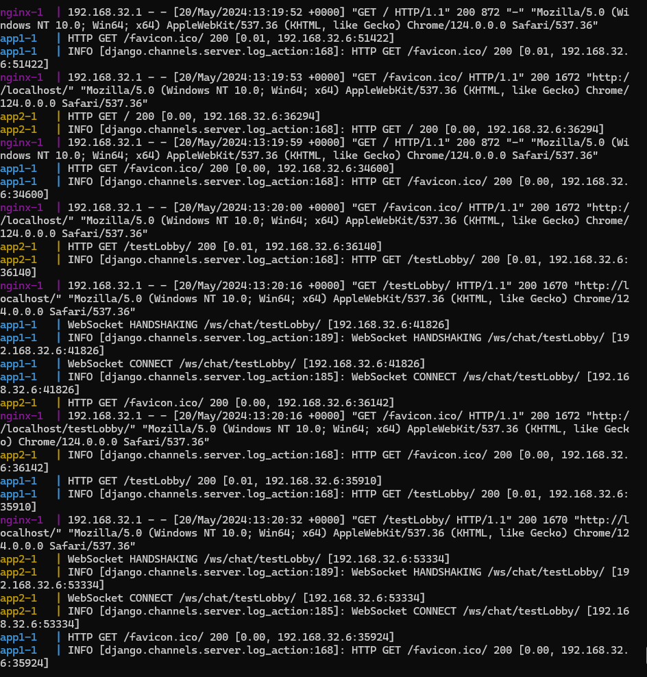

# Django live chat app


The project aim is to establish the bare minimum for a Django app to run in a multi-container environment using Docker, it also make use of the development container concept by using bind mounts and hot reloading to streamline development. Below is the list of containers:

- Nginx load balancer
- Redis caching layer
- Postgres persistence layer
- 2 instances of a Django application

## Table of content: 
- [Features](#features)
- [Installation](#installation)
- [Usage](#usage)
- [Important Notes](#important-notes)


## Features:


The balance loader divide the incoming traffic between 2 instances of the Django app using a round robin scheduling algorithm. 

The Django application make use of Django channels to enable live chat feature through WebSocket connections. Thus Redis is used as a message broker in this setup allowing the communication between the different WebSocket connections using a publish/subscribe mechanism.

The Postgres Database in intended to persist any data defined by Django ORM. 

This project also established a simple CI pipeline using Github actions that connects to Docker Hub and updates the Dockerfile image. 


## Installation: 

Docker makes this step really easy, as it will download all necessary dependencies for you. you only need to install docker on your machine as a prerequisite.

1.  Clone the repository:

``` sh
git clone https://github.com/MehdiMarzougui/Dockerized-Django-live-chat-app.git

```
2. The `compose.yaml` responsible for orchestrating the containers build as well as `setting.py` in the Django app both require environment variables to establish the credentials of the database therefore you can add `.env` file:
``` 
POSTGRES_DB=mydb
POSTGRES_USER=myuser
POSTGRES_PASSWORD=mypassword
``` 


3. Move into the directory and let docker build the image for the Django app and run the containers for you, optionally add `-d` flag for a detached mode otherwise you will get the logs from all containers in your terminal
``` sh
Docker compose up
```

## Usage:


Once the containers are up and running you can access the Django app from your host machine using `localhost` or `127.0.0.1` alternatively from another device on the same network using the `ip` of the host machine (in the latter case you might have to make changes to your firewall rules)

You will be redirected to landing page where you can type in the name of the chat lobby you want to join, Once you click `Enter` you will be able to type in messages and see any other messages from other users that have joined the same lobby. 

Below are the logs of different containers as two users connect to the webapp



## Important Notes:

This project is primarily made to showcase Docker capabilities in building images, deploying and networking containers, as well as streamlining development and deployment. By no means this project is complete and it can only act as barebone template. It may be subject to further development including but not limited to:
- User registration 
- Authentication & Authorization 
- UI development
